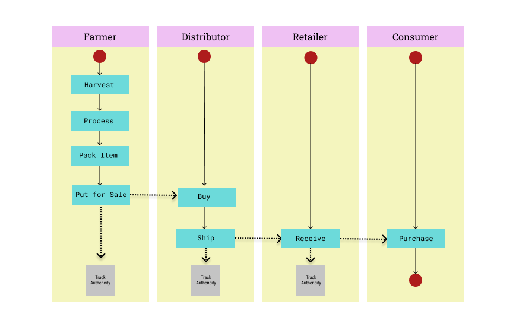
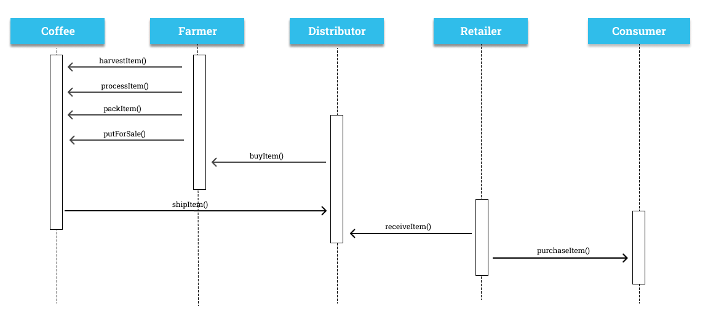
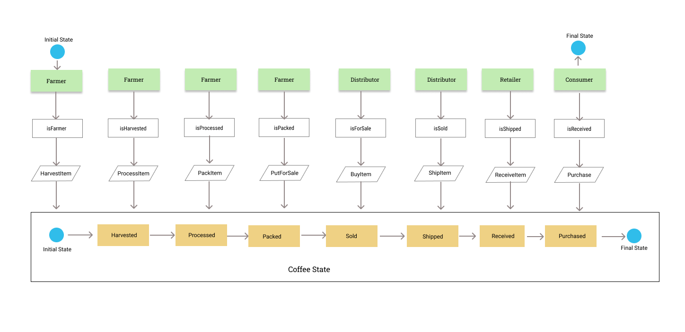
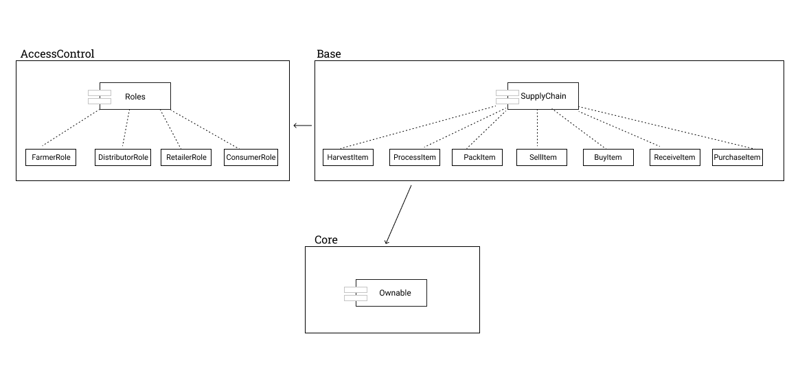
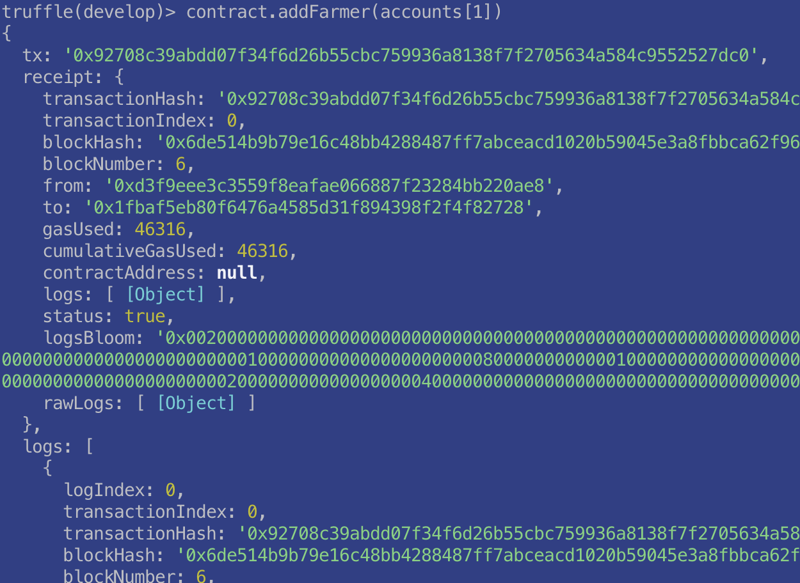
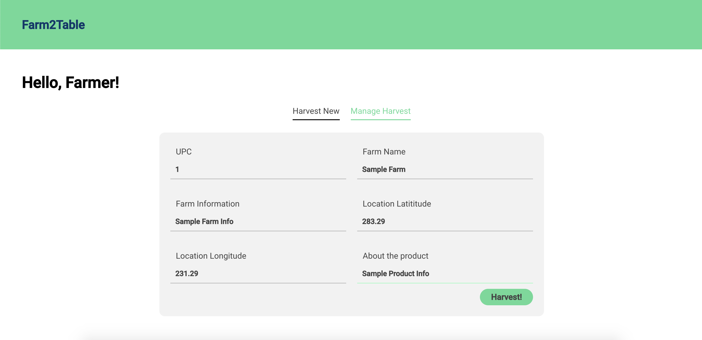
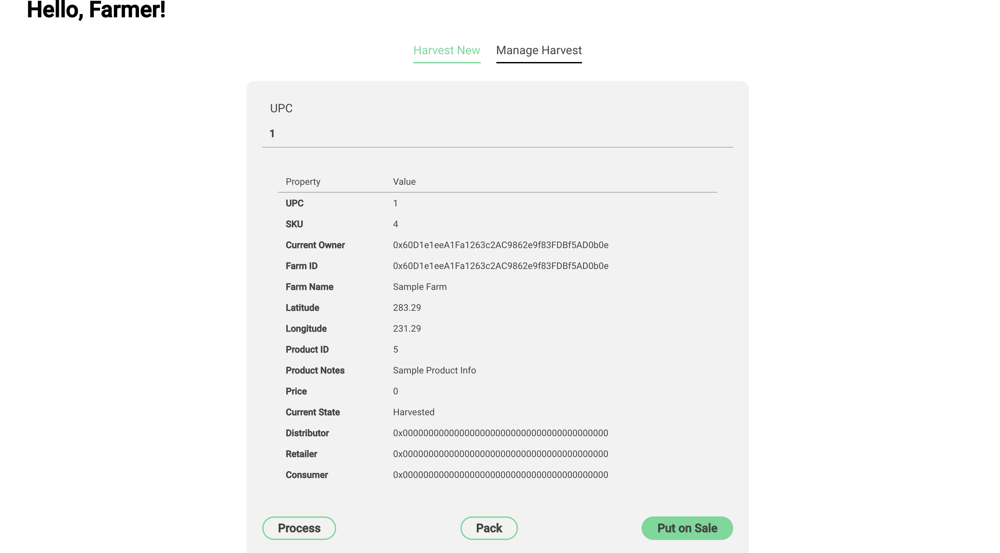

# Farm to Table Chain
## Using Smart Contracts on Ethereum
Built for the Udacity Blockchain Nanodegree Program ND1309 Project 6B

## UML Diagrams
### Activity Diagaram

### Sequence Diagaram

### State Diagaram

### Data Model Diagaram


## Libraries and Frameworks
* Truffle v5.3.4 (core: 5.3.4)
* Solidity - ^0.8.0 (solc-js)
* Node v14.15.4
* Web3.js v1.3.5
* Truffle HD Wallet Provider (@truffle/hdwallet-provider) v1.4.0
* DotEnv (Read .env files from environment) v9.0.2

## Dapp Client Info
* React v16.11.0
* Grommet (UI Library) v2.17.2
* Lodash (utility library) v4.17.21
* Styled components (CSS in JS) v5.3.0
* Web3 v1.2.2
## Rinkeby Deployment Details
Contract Address - 0x6f18092D3f52D2d2748Cca26A4592F7A310deF9b
Tx Hash - 0x0223264ef5fbab26896c46aa8875b90607c03cba6d62503be92dd9d704e0d4eb

## Steps to build
The following steps build the project locally
### Add config `.env`
First we need to create a `.env` file at the root of the project directory since it is used to add the a mnemonic and infura key to the project for deployment on a network. Add them as:

```
MNEMONIC=<Your mnemonic string>
PROJECT_ID=<Your Project ID from Infura to deploy on a public network>
```

### Run ganache-cli 
Use the mnemonic saved in .env or any other based on your requirement

```
  ganache-cli -m "<your mnemonic>"
```

### Compile 
```
   truffle compile
```

### Migrate
Deploys locally
```
  truffle migrate
```

### Test
Run Tests
```
  truffle test
```

### Run Smart Contract Locally
Since there isn't a sign up mechanism for users to register themselves in a particular role (like Farmer, Distributor, Retiler or Consumer), we're going to add addreses manually.

Enter the truffle console with
```
truffle console
```

Now inside the console, use
```
let contract = await SupplyChain.deployed()
```
This will save a reference to the deployed instance of the contract.
Now we can proceed with adding addresses to various roles manually, like this -
```
contract.addFarmer(address[1])
contract.addDistributor(address[2])
contract.addRetailer(address[3])
contract.addConsumer(address[4])
```
Entering these commands will produce outputs to the console similar to 


## Run Dapp Locally
```
cd client
npm start
```
In order to use the Dapp with the various configured roles, 
we will need to add the accounts to Metamask manually.
### Dapp Preview


